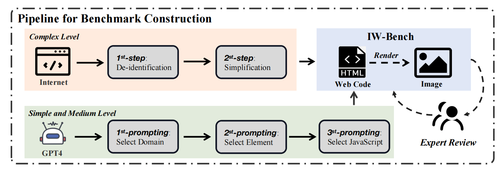

IW-Bench: Evaluating Large Multimodal Models for Converting Image-to-Web

# Benchmark Card for IW-Bench

## Table of Contents
- [Dataset Description](#dataset-description)
  - [Dataset Summary](#dataset-summary)
  - [Supported Tasks](#supported-task)
  - [Languages](#languages)
- [Dataset Structure](#dataset-structure)
  - [Data Creation Process](#data-creation-process)
  - [Data Fields](#data-fields)
  - [Data Splits](#data-splits)
  - [Annotations](#annotations)
- [Metric Design](#metric-design) 
- [Considerations for Using the Data](#considerations-for-using-the-data)
  - [Social Impact of Dataset](#social-impact-of-dataset)
  - [Discussion of Biases](#discussion-of-biases)
  - [Limitations](#limitations)
- [Additional Information](#additional-information)
  - [Dataset Curators](#dataset-curators)
  - [Licensing Information](#licensing-information)
  - [Code](#code)

## Dataset Description
- **Repository:** https://github.com/HC-Guo/IWBench

### Dataset Summary

We release IW-Bench, consisting of a dataset with images and corresponding web codes. We propose two evaluation metrics: Element Accuracy to assess the completeness of elements, and Layout Accuracy to evaluate the positional relationships of elements. Furthermore, we outline a five-hop Multimodal Chain-of-Thought method aimed at enhancing image-to-web conversion. Besides, we evaluate large multimodal models and provide an analysis of the results. Our benchmark, comprising 1200 image-web pairs, serves to deepen our understanding and refine the evaluation of large multimodal models in converting images to Web code.

### Supported Task

This is a benchmark for evaluating large multimodal models on image-to-web.

### Languages

English and Chinese

## Dataset Structure

You can directly download the version V1 benchmark data at urls like this:

`https://drive.google.com/drive/folders/1zmQHgLvF1591gXSXWponMTBBH_SA-8Pj`

### Data Creation Process

See the paper for more details.

### Data Fields

See above.

### Data Splits

N/A, this is a benchmark.

### Annotations
See the paper for more details.

#### Review process

See the paper for more details.

## Metric Design
We propose the Element Accuracy, which tests the completeness of the elements by parsing the Document Object Model (DOM) tree. Layout Accuracy is also proposed to analyze the positional relationships of elements by converting DOM tree into a common subsequence.

See the paper for more details.

## Considerations for Using the Data

### Social Impact of Dataset

Potential benefits:

- IW-Bench provides a structured and thorough framework for evaluating the performance of multimodal models, ensuring a more reliable assessment of their capabilities in web page generation.
- By identifying strengths and weaknesses in current models, IW-Bench serves as a benchmark that guides researchers and developers in improving model architectures and training methodologies.

Potential risks:

- Conducting evaluations using IW-Bench can be resource-intensive, requiring significant computational power and time, which might limit its accessibility to some research groups.
- The internet data reflects pernicious social biases. Thus models evaluated on this benchmark might also reproduce such biases at test time.

### Discussion of Biases
- Multimodal data often reflects societal biases. We encourage researchers to differentiate between using IW-Bench as an observational tool to audit model performance and the broader implications of endorsing model outputs as accurate or connecting them to downstream systems that make decisions based on these outputs. Awareness and mitigation of biases are crucial to ensure fair and ethical deployment.
- The diversity of tasks and data within IW-Bench is designed to push the boundaries of current technologies. However, this also means that models may excel in some areas while underperforming in others. Researchers should be cautious in generalizing results from specific benchmark tasks to broader applications. Ensuring the benchmark tasks are representative of real-world use cases is vital for meaningful evaluations.
- Conducting thorough evaluations using benchmarks like IW-Bench can be resource-intensive, requiring significant computational power and time. This constraint can limit accessibility for some research groups, potentially skewing the field towards well-funded institutions. Developing more efficient evaluation methods and sharing resources can help democratize access to comprehensive benchmarking.
- IW-Bench and similar benchmarks are not static; they must evolve alongside advances in multimodal technologies. Regular updates and community feedback are essential to maintain their relevance and effectiveness. Engaging with a broad range of stakeholders, including underrepresented groups, can help ensure that benchmarks address diverse needs and perspectives.

### Limitations
- Language Scope: Currently, the benchmark is limited to only two languages. Expanding the scope to include additional languages would enhance its applicability and relevance to a more diverse global audience.

- Data Quantity: The benchmark dataset requires a significant increase in samples to ensure robustness and reliability. More comprehensive data coverage across different scenarios and contexts will improve the validity of benchmark results.

## Additional Information

### Dataset Curators

This benchmark was initially curated by researchers from Beihang University, Alibaba Group, Tsinghua University, Nanyang Technological University.

### Code

Please see the our repository homepage for more details.

### Licensing Information

This code is licensed under a MIT License.

The benchmark is licensed under a
[Creative Commons Attribution-NonCommercial-ShareAlike 4.0 International License](http://creativecommons.org/licenses/by-nc-sa/4.0/).

