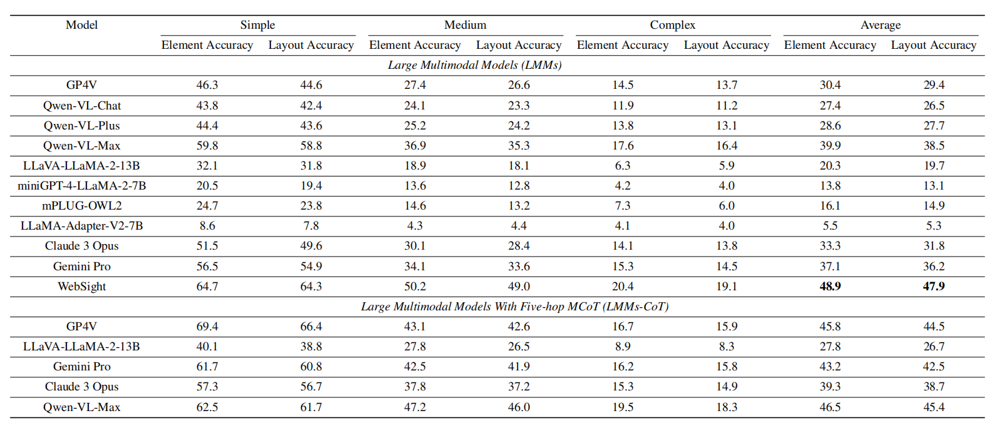

# IW-Bench: Evaluating Large Multimodal Models for Converting Image-to-Web

----

# ✨Introduction
👋 Welcome, this is a benchmark for evaluating large language models for Converting Images to HTML Code. 😊 We welcome everyone to participate and contribute 🌟. 

# 🛠Environment
We recommend using conda
```
conda create -n iwbench python=3.10
conda activate iwbench
pip install -r requirements.txt

# We use Chrome for HTML to image generation. Please initialize Playwright before use.
# thie will download Chromium version.xxx.xxx.xxx
playwright install
```

# 🚨Dataset
Download the version V2 dataset from [Google Drive](https://drive.google.com/file/d/1oAnXzw_reVBuDtPQrd7vKw8WTlts4Qx-/view?usp=sharing) and place it in the "./dataset" directory.

# 📈Evaluation
Using your LMM, generate the corresponding HTML code based on the input images. For example, use the PNG files in the 'dataset' directory as input and save the generated results in a folder, in a format like 'code/baseline/dataset-llava-v1.5-13b-html' or 'code/baseline/dataset-websight-html'. The '.html' and '.htmlcoco' files should be generated from the corresponding PNG files in the 'dataset' directory.

```
cd code/
python benchmark.py --input_dir ./baseline/dataset-qwenvlchat-html
```

# 📊Result
Accuracy scores on our IW-bench. Element Accuracy is employed to gauge the comprehensiveness of elements, while Layout Accuracy is utilized to evaluate the effectiveness of webpage layout. These metrics are categorized into three difficulty levels: simple, medium, and complex. Each level is accompanied by corresponding scores and contributes to the final overall average score.



## Licenses

[](https://lbesson.mit-license.org/)

This work is licensed under a MIT License.

[](http://creativecommons.org/licenses/by-nc-sa/4.0/)

The dataset is licensed under a
[Creative Commons Attribution-NonCommercial-ShareAlike 4.0 International License](http://creativecommons.org/licenses/by-nc-sa/4.0/).


## cite
```
@misc{guo2024iwbenchevaluatinglargemultimodal,
      title={IW-Bench: Evaluating Large Multimodal Models for Converting Image-to-Web}, 
      author={Hongcheng Guo and Wei Zhang and Junhao Chen and Yaonan Gu and Jian Yang and Junjia Du and Binyuan Hui and Tianyu Liu and Jianxin Ma and Chang Zhou and Zhoujun Li},
      year={2024},
      eprint={2409.18980},
      archivePrefix={arXiv},
      primaryClass={cs.CL},
      url={https://arxiv.org/abs/2409.18980}, 
}
```

