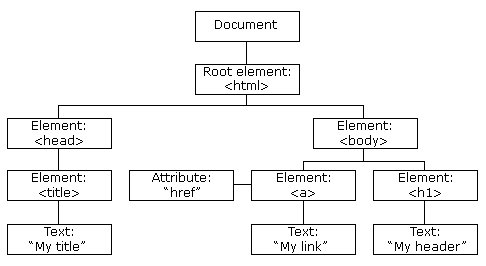

# DOM Tree

## 概述

DOM（文档对象模型）树是表示HTML或XML文档结构的树形结构。它将文档中的每个元素、属性、文本和注释都表示为一个节点，并通过节点之间的父子关系来构建整个文档的层次结构。DOM树提供了一种方便的方式来操作和访问文档中的元素及其相关信息。

## 节点类型

在DOM树中，每个节点都有一个节点类型，表示节点的不同角色和功能。以下是常见的DOM节点类型：

1. 元素节点（Element Node）：表示HTML或XML文档中的元素，如`
`、`
`、``等。它们是DOM树的主要构建块。
2. 文本节点（Text Node）：表示元素中的文本内容，如`Hello World`。文本节点是元素节点的子节点。
3. 属性节点（Attribute Node）：表示元素的属性，如`src`、`href`等。属性节点是元素节点的一部分。
4. 注释节点（Comment Node）：表示文档中的注释，如`<!-- This is a comment -->`。注释节点是元素节点的兄弟节点。
5. 文档节点（Document Node）：表示整个文档的根节点，是DOM树的顶级节点。

## DOM树的构建

DOM树的构建是通过解析HTML或XML文档而完成的。解析器将文档内容解析为节点，并将这些节点连接起来形成DOM树的结构。

DOM树的构建过程如下：

1. 解析器读取文档的起始标签，创建一个元素节点，并将其作为文档节点的子节点。
2. 解析器继续读取标签和文本内容，并根据节点类型创建相应的节点，并将其添加到适当的位置。
3. 解析器读取到结束标签时，将相应的元素节点从树中移除。
4. 解析器继续解析文档，直到遍历完所有内容。

## DOM树的特点

DOM树具有以下特点：

1. 层次结构：DOM树以层次结构的形式组织元素节点，使得可以通过父子关系进行导航和操作。
2. 全局访问：DOM树作为文档对象模型，提供了API来访问和操作树中的节点。可以使用JavaScript或其他编程语言通过DOM API来查询、修改或删除树中的节点。
3. 动态更新：DOM树是可动态更新的，当文档内容发生变化时，可以通过DOM API来更新树的结构和内容。
4. 跨平台：DOM树可以在不同的平台和环境中使用，如浏览器、服务器端和移动设备等。

## DOM树的应用

DOM树在Web开发中有广泛的应用，包括但不限于以下方面：

1. 操作和修改文档：通过DOM树，可以使用JavaScript来操作和修改文档的内容、样式和结构。可以动态地添加、删除或修改元素节点、属性和文本内容。
2. 事件处理：DOM树提供了事件模型，可以通过监听事件来响应用户的交互操作，如点击、鼠标移动等。可以使用DOM API注册事件处理程序，以便在特定事件发生时执行相应的操作。
3. 数据提取和处理：通过DOM树，可以轻松地提取文档中的数据。可以使用DOM API查询和遍历节点，提取所需的数据，并进行相应的处理和分析。
4. 动态页面交互：通过DOM树，可以实现动态页面效果和交互。可以使用DOM API实时更新页面，显示或隐藏元素，创建动画效果，实现表单验证等。

## 总结

DOM树是表示HTML或XML文档结构的树形结构，将文档中的元素、属性、文本和注释表示为节点，并通过节点之间的父子关系构建整个文档的层次结构。DOM树提供了一种方便的方式来操作、访问和修改文档中的元素及其相关信息。通过DOM API，可以实现对DOM树的查询、修改、删除和动态更新，从而实现丰富的Web应用程序和交互效果。